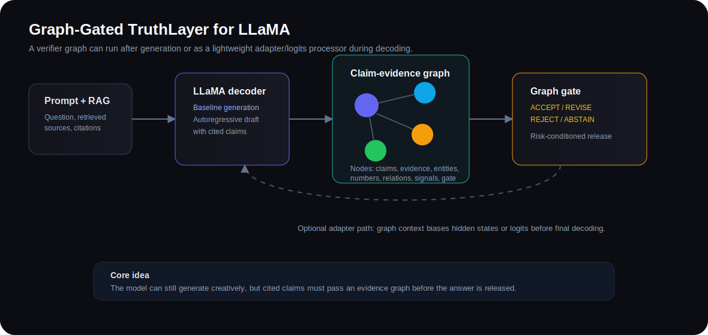
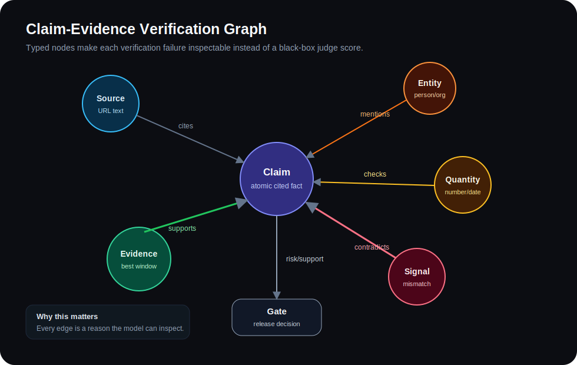
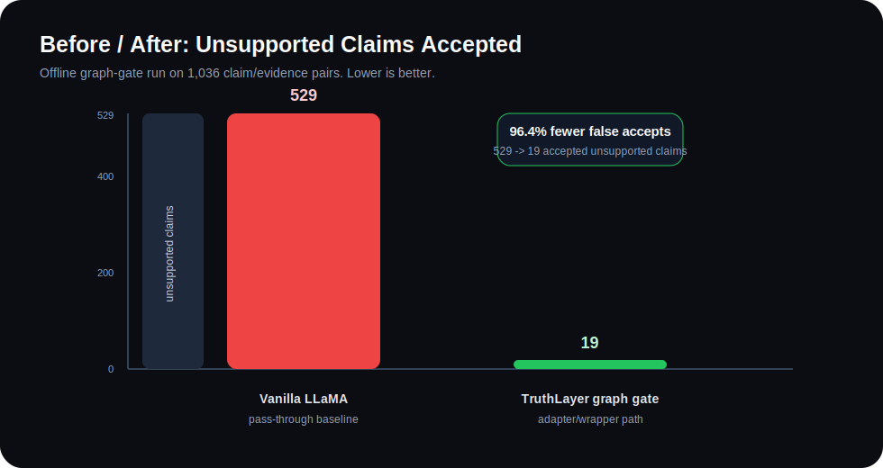

# TruthLayer: Graph-Gated Verification-Augmented Generation for Reducing Citation Hallucination in LLaMA-Style Transformers

**Tanush Appapogu**  
July 2026

## Abstract

Citation hallucination occurs when a language model attaches a real source to a claim the source does not support. TruthLayer is a graph-gated verification architecture for transformer pipelines. It decomposes generated answers into atomic cited claims, retrieves source evidence, constructs a typed claim-evidence graph, runs deterministic contradiction signals, and routes each answer through an acceptance gate. The same graph can run after generation or inside a LLaMA-style wrapper through a lightweight graph adapter and risk-aware logits processor. On a 1,036-case benchmark, the deterministic verifier resolves 215 cases with 99.1% accuracy and a 0.8% false-accept rate on decided cases. The Python graph gate reduces accepted unsupported claims from 529/529 for a pass-through baseline to 19/529, a 96.4% reduction before NLI or LLM fallback.

## Architecture



TruthLayer adds a release-control layer around a transformer:

1. LLaMA or another decoder produces a cited draft.
2. TruthLayer decomposes the draft into atomic claims.
3. Retrieved source text is split into evidence windows.
4. A typed claim-evidence graph is built.
5. Deterministic signals add support or contradiction edges.
6. The graph gate returns `ACCEPT`, `REVISE`, `REJECT`, or `ABSTAIN`.

## Claim-Evidence Graph



The graph is:

```text
G = (V, E, node_type, edge_type)
```

Node types:

| Node | Role |
|---|---|
| `claim` | Atomic cited fact emitted by the model |
| `source` | Retrieved URL or evidence document |
| `evidence` | Best matching evidence window |
| `entity` | Named person, organization, place, or object |
| `quantity` | Number, date, count, percentage, or measurement |
| `relation` | Extracted predicate such as "founded by" |
| `signal` | Detector output such as numeric contradiction |
| `gate` | Final release decision |

Gate policy:

```text
REJECT  if contradiction_score >= 0.78
ABSTAIN if evidence_coverage < 0.18
ACCEPT  if support_score >= 0.78 and coverage >= 0.74 and contradiction_score < 0.25
REVISE  otherwise
```

## LLaMA Integration

The repo includes an optional Python package in `truthlayer_llama/`.

| File | Purpose |
|---|---|
| `evidence_graph.py` | Builds the graph from draft text and evidence |
| `adapter.py` | Graph message-passing adapter for decoder hidden states |
| `logits_processor.py` | Risk-aware Hugging Face logits processor |
| `llama_wrapper.py` | Baseline vs TruthLayer verified generation wrapper |

Adapter equation:

```text
H' = H + sigmoid(W_g z_G) * z_G
```

where `H` is the decoder hidden state and `z_G` is the pooled graph context.

## Results

### Stage 1 Deterministic Verifier

| Metric | Value |
|---|---:|
| Accuracy on decided cases | 99.1% |
| Precision | 99.2% |
| Recall | 99.2% |
| F1 | 99.2% |
| False accept rate | 0.8% |
| Coverage | 20.8% |
| True positives | 126 |
| False positives | 1 |
| False negatives | 1 |
| True negatives | 87 |

### Graph-Gated LLaMA Wrapper



| System | Accepted unsupported claims | False accept rate |
|---|---:|---:|
| Vanilla LLaMA / RAG pass-through | 529 / 529 | 100.0% |
| TruthLayer Python graph gate | 19 / 529 | 3.6% |

Additional graph-gate counts:

- Rejected unsupported claims: 103
- Routed unsupported claims to revise/abstain: 407
- Accepted supported claims: 86
- Routed supported claims to revise/abstain: 401
- False rejected supported claims: 20

## Run

Offline graph-gate evaluation:

```bash
python3 experiments/offline_graph_gate_eval.py
```

Python package CLI:

```bash
python3 -m truthlayer bench
python3 -m truthlayer verify --claim "..." --evidence-file evidence.txt
python3 -m truthlayer graph --claim "..." --evidence-file evidence.txt
```

Real model before/after run:

```bash
python3 experiments/run_llama_before_after.py \
  --model meta-llama/Llama-3.2-1B-Instruct \
  --prompt "Answer the question with citations..." \
  --evidence-file evidence.txt
```

## References

See [`references.bib`](references.bib). Core related work includes FEVER, RAG, RETRO, K-BERT, GraphFormers, Self-RAG, FActScore, SAFE, MiniCheck, and GraphRAG.
